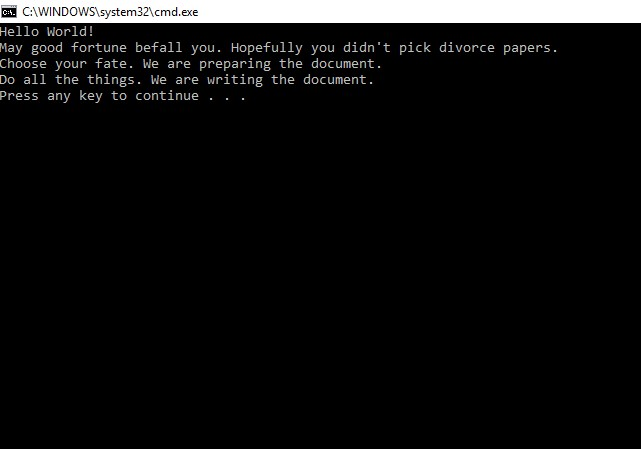

# FactoryDesignLab

## About

This is a console app created using the Factory Design Pattern. This is different than a standard MVC design pattern. What Factory design essentially means is that objects are derived from a subset of multiple abstract classes. The objects are then are concretely created through a factory. 

Maybe the easiest way to think of it is literally using a factory as a model. Many objects come out of a factory, but the factory does not simply create the objects. The factory takes component pieces of objects, then puts them together. The objects themselves are instantiated through concrete creator models, which inheret classes or properties from the component abstract classes. Rather than using a MVC approach, where each object is derived from a model that contains all the properties and fields, in a factory pattern an object is derived from a concrete class, which itself inherets multiple abstract classes.

The primary advantage of a factory design model is that components can be used in different combinations to instantiate different, but similar objects. For example, if a factory creating cars, then a car with black paint and a car with white paint can both be instantiated in the same factory, based on the component classes that have different color properties. This is opposed to an MVC concept where a single car is created, with the potential to override certain base properties and perhaps change it to white or black. Obviously a simplified example, but the principle remains the same.

In this project, the object type is a document, which comes either as Divorce Papers or a Resume. Each type of paper is gathered within the factory of a document creator, which can then be referenced by another class to create a new paper. The screenshot with the console output is shown below:

## How to Use
This program requires Visual Studio. There are no databases or live deployments. All a user has to do is navigate and run the program.cs file to see the output. A user can also manually change the type of document created, though for both Divorce Papers and Resumes the console output will stay the same.

## Licensing
This program is MIT licensed.

